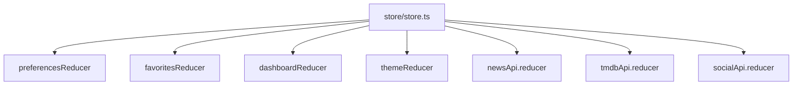

# Architecture Guide

This document describes the current implementation of the Personalized Content Dashboard and the responsibilities of the major parts of the codebase.

## 1. High-level architecture

The project is a Next.js app-router application with:

- a React UI layer for dashboard screens and content cards
- Redux Toolkit for app-level state management
- RTK Query for API-backed data fetching
- server-side route handlers for external API access
- localStorage for preference persistence
- mock data for social content

## 2. Frontend architecture

The frontend is organized around page routes and reusable UI blocks.

### Application routes

- `app/page.tsx` redirects to `/dashboard`
- `app/dashboard/page.tsx` renders the main dashboard layout
- `app/favorites/page.tsx` renders the favorites page inside the shared layout
- `app/settings/page.tsx` renders the settings screen inside the shared layout

### Shared layout

`components/layout/DashboardLayout.tsx` is the shared shell for most screens. It renders:

- the sidebar
- the header with search and theme controls
- the requested content section (`dashboard`, `favorites`, or `settings`)

## 3. Folder structure and responsibilities

### `app/`

Holds the App Router pages and route handlers.

- `app/api/news/route.ts` loads news from NewsAPI
- `app/api/movies/route.ts` loads movies from TMDB
- `app/layout.tsx` wraps the app with the Redux provider
- `app/globals.css` contains the root theme tokens and base CSS variables

### `components/`

Contains reusable UI and feature modules.

- `components/content/` — feed, cards, loading, empty states, trending panel
- `components/search/` — global search input and preview results
- `components/settings/` — preferences and theme switchers
- `components/favorites/` — favorites list and saved-item grid
- `components/layout/` — sidebar, header, dashboard layout
- `components/providers/ReduxProvider.tsx` — applies persisted state after hydration

### `hooks/`

Custom hooks used across the app.

- `useDebounce.ts` delays updates before search is applied
- `useLocalStorage.ts` and `lib/storage.ts` manage browser storage persistence

### `store/`

Contains the Redux store and its feature slices.

- `store/store.ts` configures the reducer tree and RTK Query middleware
- `store/slices/preferencesSlice.ts` stores the user-selected categories
- `store/slices/favoritesSlice.ts` stores saved content items
- `store/slices/themeSlice.ts` stores light/dark mode state
- `store/slices/dashboardSlice.ts` keeps re-ordered feed items
- `store/api/newsApi.ts` defines the News API query
- `store/api/tmdbApi.ts` defines the TMDB query
- `store/api/socialApi.ts` defines a mock social data source using `fakeBaseQuery()`

### `types/`

Defines the TypeScript models used across the app:

- `content.ts` — shared content item model
- `movie.ts` — TMDB response shape
- `news.ts` — NewsAPI response shape
- `social.ts` — mock social post types
- `preferences.ts` — category and theme types

### `mocks/`

- `socialPosts.ts` contains the local mock social dataset used by the social API slice

### `lib/`

Holds cross-cutting helpers:

- `storage.ts` handles reading and writing localStorage safely
- `constants.ts` defines app constants such as nav items and TMDB image base URL
- `utils.ts` provides date formatting and class-name merging helpers

## 4. Redux architecture

The store is configured with multiple reducers and three API slices.

### State responsibilities

- `preferences` — selected dashboard categories
- `favorites` — saved cards
- `theme` — light or dark mode
- `dashboard` — drag-reordered feed state contents
- `newsApi` — fetched news data
- `tmdbApi` — fetched movie data
- `socialApi` — mock social results

## 5. Data flow

### Dashboard data flow

The main feed uses a combination of Redux state and API hooks.

1. User opens `/dashboard`
2. The layout renders `Feed` and `Trending`
3. `Feed` reads the current preferences from Redux
4. It triggers lazy queries for news and movies
5. It builds `ContentItem` objects from API payloads
6. It stores paginated data in page maps and merges them into a display list
7. The final list is rendered as drag-and-drop cards

### Search flow

1. `SearchBar` stores the raw query state
2. `useDebounce` delays the update by 450 ms
3. the debounced value is passed to `SearchResults`
4. `SearchResults` calls `useGetNewsQuery`, `useGetMoviesQuery`, and `useGetSocialPostsQuery`
5. matching entries are filtered and displayed in a dropdown list
6. selecting a result clears the current search input

### Infinite scroll flow

1. `Feed` mounts an `IntersectionObserver` sentinel
2. when the sentinel gets near the bottom, the feed checks `hasMore`
3. if more pages are available and not already requested, it triggers the next page fetch
4. the page data is appended to the local page cache
5. the list re-renders without discarding the already-loaded content

### Favorites flow

1. `ContentCard` dispatches `toggleFavorite(item)`
2. `favoritesSlice` adds or removes the item by ID
3. the header count updates based on the Redux list length
4. `FavoritesList` reads the same state and renders saved items

### Preferences flow

1. `CategorySelector` dispatches `toggleCategory(category)`
2. the preference list is updated in Redux
3. `ReduxProvider` loads saved preferences from `localStorage` on hydration
4. the dashboard uses the first selected category as the primary feed source

### Error/fallback flow

The app handles missing API keys and unsuccessful upstream calls gracefully:

- route handlers respond with empty payloads
- the UI shows loading skeletons and empty states
- fallback images keep the layout stable
- invalid/malformed data is normalized before rendering

## 6. Testing architecture

The project separates tests by type.

### Unit tests

- `tests/components/` validates UI rendering and component behavior
- `tests/slices/` validates reducer logic for favorites and preferences

### Integration tests

- `tests/integration/api-fallback.test.ts` ensures the route handlers recover when upstream requests fail

### End-to-end tests

- `e2e/*.spec.ts` covers dashboard rendering, search, favorites, dark mode, and infinite scroll behavior
- `playwright.config.ts` runs the tests against the local Next.js dev server on Chromium

## 7. Notes

The architecture is intentionally straightforward and matches the implemented project rather than a broader production stack. There is no multi-service backend, no auth layer, and no external persistence beyond localStorage and the live external API calls proxied through Next.js route handlers.
